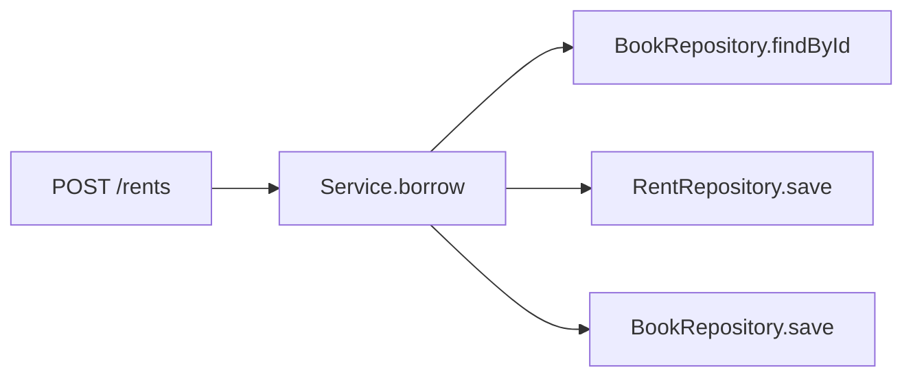

# API

## Users
- GET /users/{id}
- POST /users

## Books
- GET /books?keyword=
- GET /books/{id}
- POST /books

## Rents
- POST /rents
- POST /rents/{id}/return
- GET /users/{id}/rents

## Lectures / Documents
- GET /lectures
- POST /documents

## Lockers / Assign
- GET /lockers
- POST /assign

