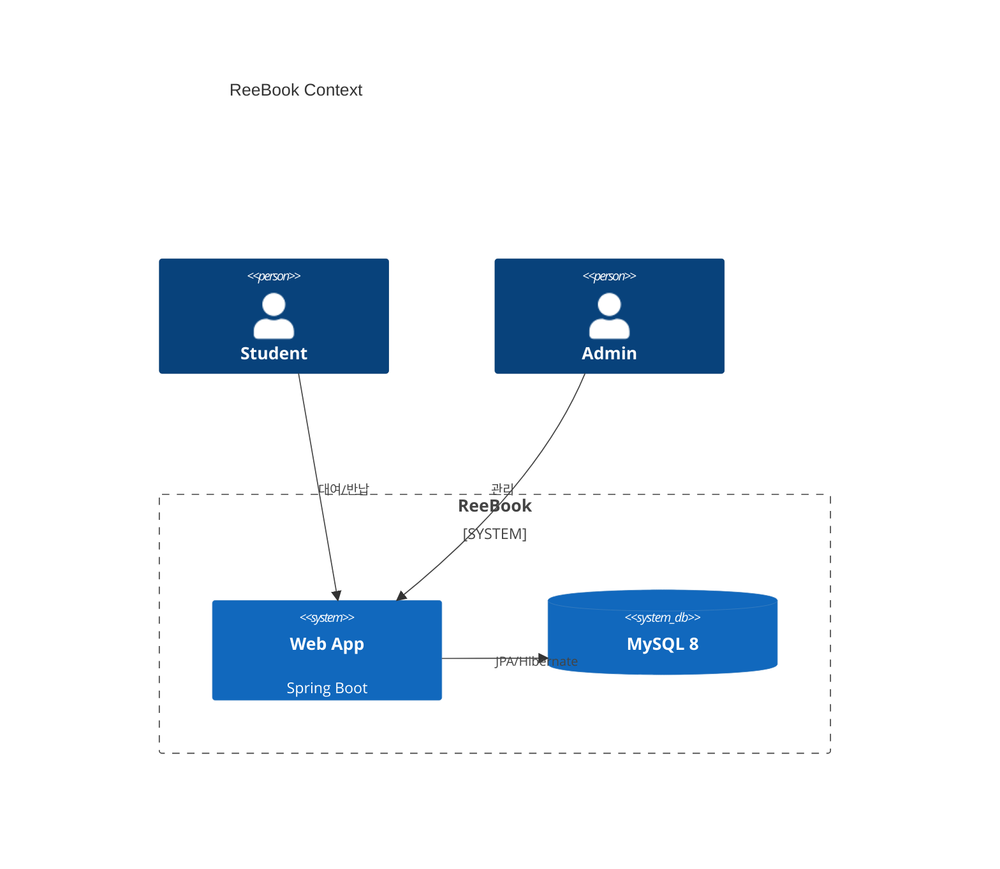
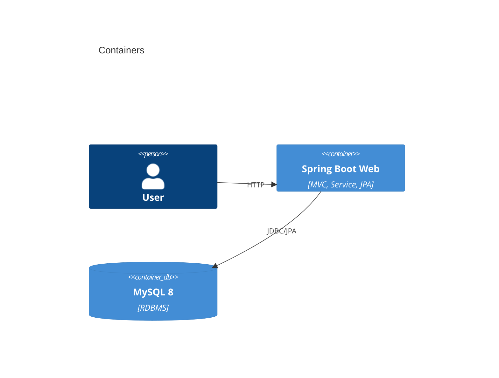
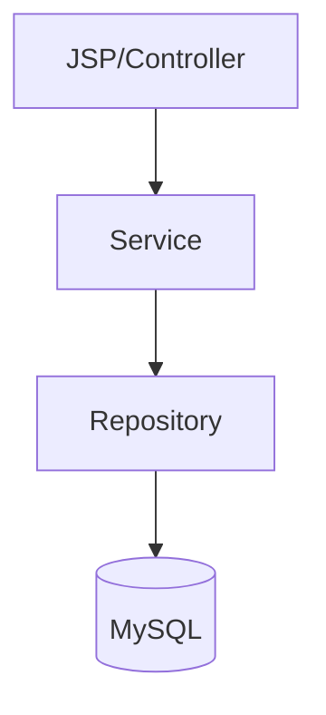
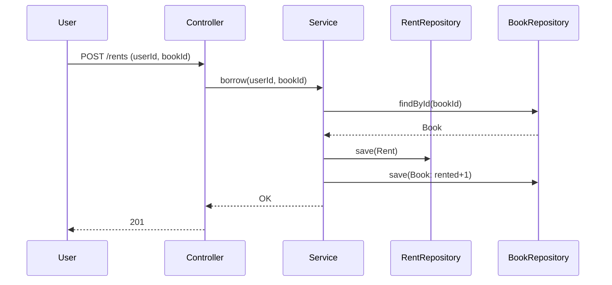
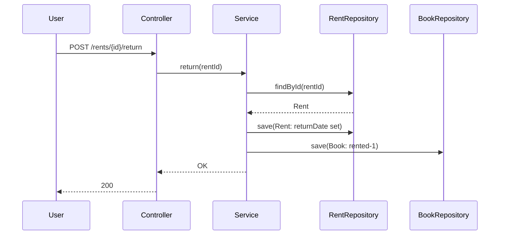

# Architecture

## 시스템 컨텍스트

```mermaid
C4Context
title ReeBook Context
Person(student, "Student")
Person(admin, "Admin")
System_Boundary(sys, "ReeBook") {
  System(web, "Web App", "Spring Boot")
  SystemDb(db, "MySQL 8")
}
Rel(student, web, "대여/반납")
Rel(admin, web, "관리")
Rel(web, db, "JPA/Hibernate")
```

## 컨테이너

```mermaid
C4Container
title Containers
Person(user, "User")
Container(web, "Spring Boot Web", "MVC, Service, JPA")
ContainerDb(db, "MySQL 8", "RDBMS")
Rel(user, web, "HTTP")
Rel(web, db, "JDBC/JPA")
```

## 레이어

```mermaid
flowchart TB
UI[JSP/Controller] --> SVC[Service]
SVC --> REPO[Repository]
REPO --> DB[(MySQL)]
```

## 대여 시퀀스

```mermaid
sequenceDiagram
participant U as User
participant C as Controller
participant S as Service
participant R as RentRepository
participant B as BookRepository

U->>C: POST /rents (userId, bookId)
C->>S: borrow(userId, bookId)
S->>B: findById(bookId)
B-->>S: Book
S->>R: save(Rent)
S->>B: save(Book: rented+1)
S-->>C: OK
C-->>U: 201
```

## 반납 시퀀스

```mermaid
sequenceDiagram
participant U as User
participant C as Controller
participant S as Service
participant R as RentRepository
participant B as BookRepository

U->>C: POST /rents/{id}/return
C->>S: return(rentId)
S->>R: findById(rentId)
R-->>S: Rent
S->>R: save(Rent: returnDate set)
S->>B: save(Book: rented-1)
S-->>C: OK
C-->>U: 200
```