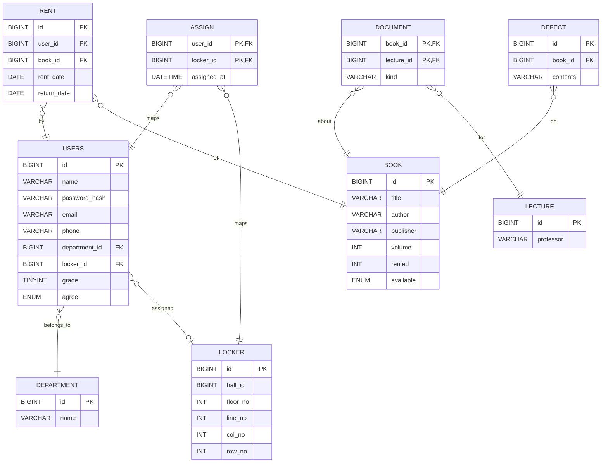

# ER / Schema

```mermaid
erDiagram
DEPARTMENT {
  BIGINT id PK
  VARCHAR name
}
LOCKER {
  BIGINT id PK
  BIGINT hall_id
  INT floor_no
  INT line_no
  INT col_no
  INT row_no
}
USERS {
  BIGINT id PK
  VARCHAR name
  VARCHAR password_hash
  VARCHAR email
  VARCHAR phone
  BIGINT department_id FK
  BIGINT locker_id FK
  TINYINT grade
  ENUM agree
}
BOOK {
  BIGINT id PK
  VARCHAR title
  VARCHAR author
  VARCHAR publisher
  INT volume
  INT rented
  ENUM available
}
RENT {
  BIGINT id PK
  BIGINT user_id FK
  BIGINT book_id FK
  DATE rent_date
  DATE return_date
}
LECTURE {
  BIGINT id PK
  VARCHAR professor
}
DOCUMENT {
  BIGINT book_id PK,FK
  BIGINT lecture_id PK,FK
  VARCHAR kind
}
DEFECT {
  BIGINT id PK
  BIGINT book_id FK
  VARCHAR contents
}
ASSIGN {
  BIGINT user_id PK,FK
  BIGINT locker_id PK,FK
  DATETIME assigned_at
}

USERS }o--|| DEPARTMENT : belongs_to
USERS }o--o| LOCKER : assigned
RENT }o--|| USERS : by
RENT }o--|| BOOK : of
DOCUMENT }o--|| BOOK : about
DOCUMENT }o--|| LECTURE : for
DEFECT }o--|| BOOK : on
ASSIGN }o--|| USERS : maps
ASSIGN }o--|| LOCKER : maps
```